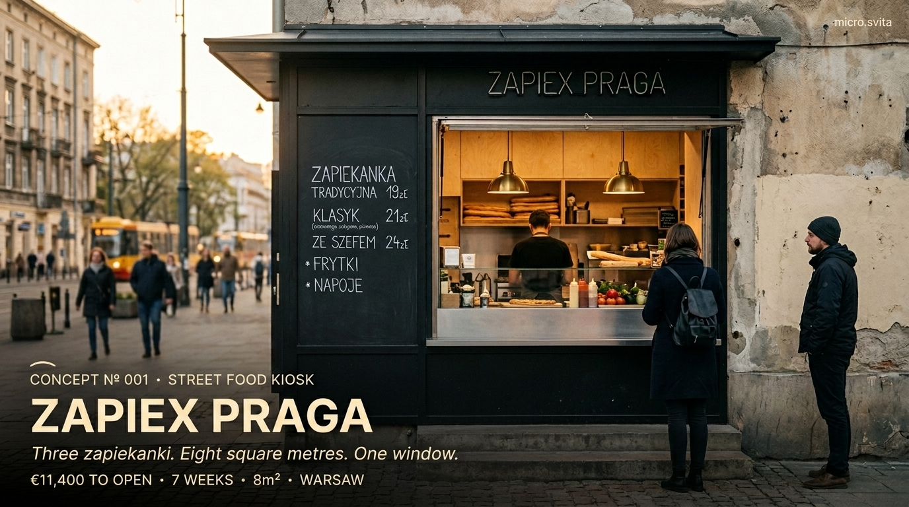
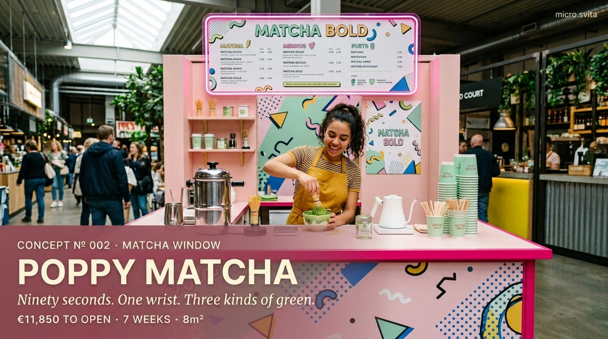
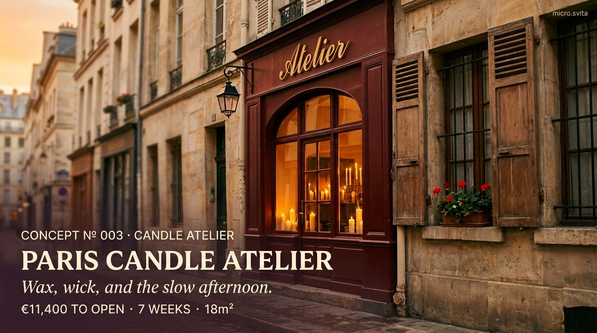
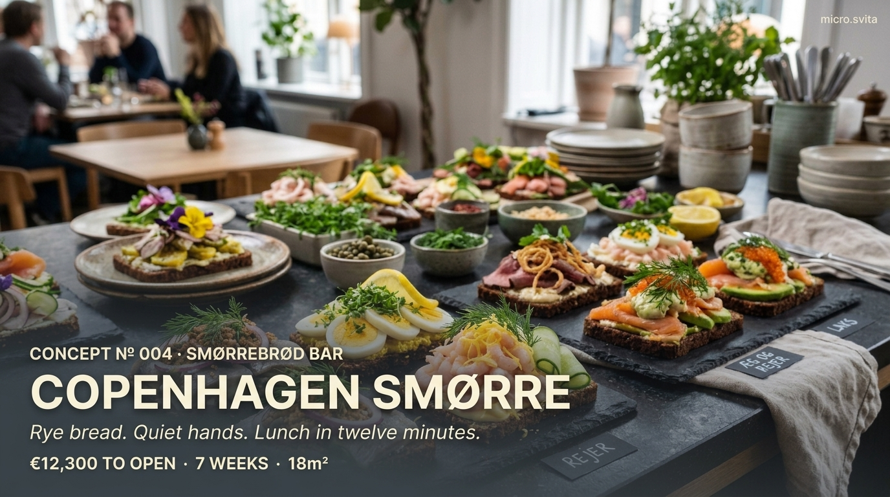
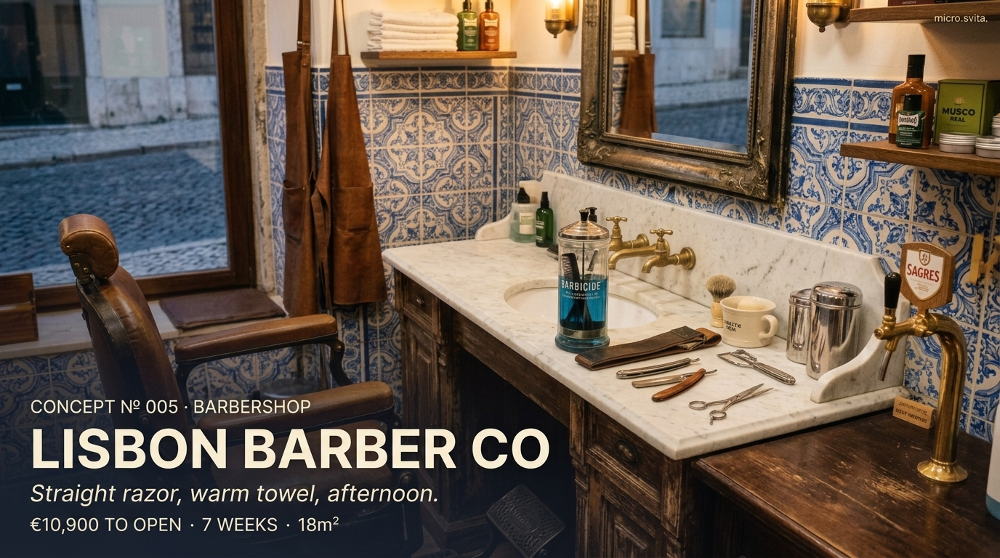
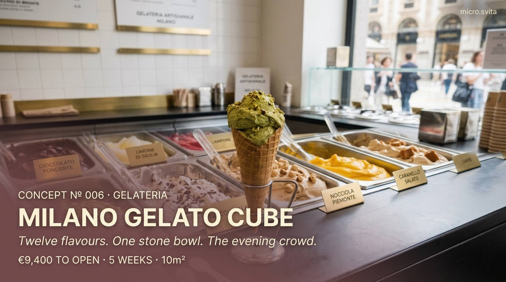
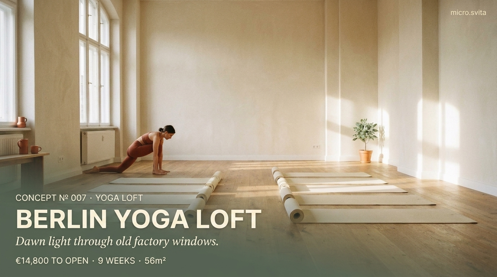
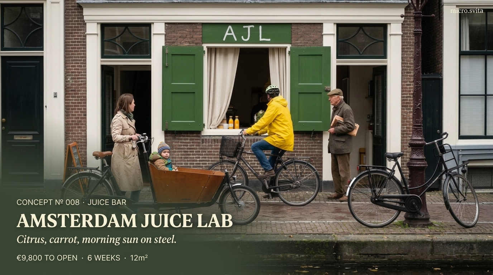
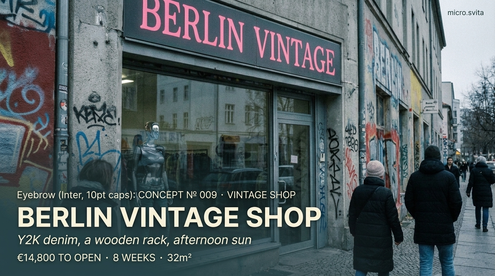
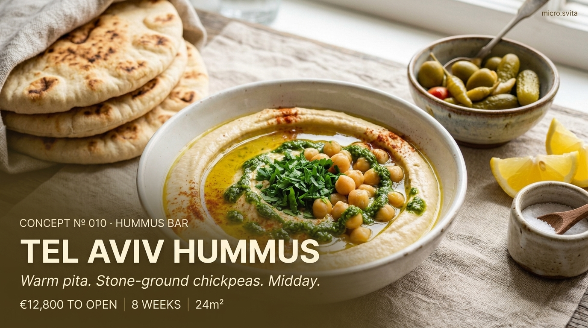

# SVITA MICRO — длинные посты (RU)

Полные художественные версии. Картинка + рассказ + ссылка + хэштеги.

---

## 01 · ZAPIEX PRAGA

На Праге-Полноц, там где трамвай делает поворот у старого завода, есть окно. Восемь квадратных метров за стеклом, внутри — женщина в белом фартуке и печь с раскалёнными камнями. Больше ничего. Ни столов, ни стульев, ни меню на четыре страницы с фотографиями еды.

В семь утра поднимается жестяная ставня, и на меловой доске появляются три слова: **сыр · грибы · шпинат**. К десяти у окна стоит очередь — строители с соседней стройки, студенты политехники, бабушка, которая каждый день берёт две с собой внучке. К полудню подтягиваются туристы: фотографируют очередь, потом едят стоя, на картонной подложке, обжигая пальцы.

Запеканку пекут на половинке багета с моцареллой и грибами — как делают в Польше с семидесятых. Ничего нового, ничего изобретённого. Просто хорошо сделанная уличная еда, без претензии на гастрономию. В полночь ставня опускается. Улица снова пустая. Завтра всё сначала.

https://micro.svita.ai/view.html?c=warsaw-zapiekanka-okno

#microbusiness #warsaw #streetfood #zapiekanka #svita

---

## 02 · POPPY MATCHA

Восемь метров кафе, втиснутых между цветочным магазином и велопрокатом. Снаружи — мятно-зелёная дверь и розовая неоновая надпись **POPPY**, внутри — геометрический хаос в духе Memphis: жёлтые треугольники на полу, чёрно-белая зигзаг-барная стойка, керамика ручной работы с неровными краями. Как будто 1986-й заглянул в чайный домик Киото и решил остаться.

Бариста в белой футболке достаёт из банки церемониальный матча-порошок — цвет хвои, привезён из Удзи. Венчик из бамбука стучит по тяжёлой пиале, пять раз против часовой стрелки, десять вниз-вверх. В пене появляется то, ради чего люди приходят сюда каждое утро — шёлковая зелёная поверхность, без единого пузыря.

Меню на одной странице: матча классическая, матча-латте, матча айс. Никаких сиропов, никаких веганских взбитых сливок, никакого карамельного дрицля. Только порошок, вода правильной температуры и овсяное молоко, если попросишь. Цена одна для всех трёх позиций. Сладкого нет совсем — если хочется, рядом есть булочная.

https://micro.svita.ai/view.html?c=poppy-matcha

#matcha #microcafe #amsterdam #memphisdesign #svita

---

## 03 · PARIS CANDLE ATELIER

В задней комнате на улице Сен-Поль пахнет воском, бергамотом и немного кедром. Восемнадцать метров мастерской, разделённой деревянной перегородкой: впереди — витрина, сзади — производство. Девушка в льняном фартуке медленно льёт соевую массу в стеклянный стакан, фитиль держится ровно на металлической шпильке, — и всё это при свете одной настольной лампы.

В витрине — ряды пронумерованных свечей на дубовой полке. **No.1** — инжир и кедр. **No.7** — чёрный чай с бергамотом. **No.12** — гроза в мае, озон и мокрый асфальт. **No.23** — пачули, сандал и дым. Всего тридцать композиций, каждую неделю одна уходит, одна новая появляется.

Парфюмер из Грасса присылает эссенции в маленьких коричневых флаконах раз в две недели. Никакой синтетики, только натуральные масла — поэтому свеча стоит €38, а не €8, и горит она шестьдесят часов, а не двенадцать. На бирке — дата заливки, имя мастера и номер партии. Как вино.

https://micro.svita.ai/view.html?c=paris-candle-atelier

#slowcraft #paris #candles #parfum #svita

---

## 04 · COPENHAGEN SMØRRE

В половину двенадцатого заходит первый офисный клерк в сером костюме, заказывает сельдь с укропом и бокал пива. В двенадцать очередь доходит до двери: архитекторы, адвокаты, студентки дизайн-школы, турист-американец, который не знает, что надо брать две порции. К часу последний смёрребрёд с сельдью уходит на вынос, и на меловой доске остаётся только хлеб с яйцом и кресс-салатом.

Открытые бутерброды на тёмном ржаном — датский обед, который так и не стал мировой модой, и слава богу. Восемнадцать метров зала, десять высоких мест у стойки из светлого дуба, одна повариха в клетчатой рубашке. За её спиной — стеклянная витрина, где каждый слой виден как архитектура: масло, хлеб, рыба, лук, укроп, майонез, икра.

Шесть позиций в меню, все классика: сельдь, лосось копчёный, ростбиф с ремуладом, креветки с майонезом, яйцо с кресс-салатом, картофель с луком. Ничего нового, ничего изобретённого. Цена €7 за штуку, два — сытный обед, три — слишком. Пиво разливное, кофе фильтр, акавита — если день был тяжёлый.

https://micro.svita.ai/view.html?c=copenhagen-smorre

#smorrebrod #copenhagen #lunchbar #danishfood #svita

---

## 05 · LISBON BARBER CO

Азулежу на стене — синий геометрический узор, который португальский мастер клал вручную три недели, по старым образцам XVIII века. Восемнадцать метров зала, четыре кожаных кресла винтажного производства Takara Belmont, зеркала в латунных рамах. Бритвенные станки, ножницы, расчёски разложены на мраморной полке — как инструменты хирурга, каждая на своём месте.

В углу стоит кран с местным крафтом — IPA от маленькой пивоварни из Алфамы. Пока клиент ждёт своей очереди, бармен (он же младший барбер) наливает ему халф-пинту в стеклянный бокал. Стрижка занимает сорок минут: мытьё, ножницы, машинка, бритьё опасной, горячее полотенце, массаж головы с тоником. За это время можно успеть обсудить футбол Бенфики, политику Косты и то, как правильно варить баккалау.

Записи нет — только живая очередь. По выходным — ждать час. Цена €25 за классическую, €35 с бритьём, €45 с бородой. Чаевые в стеклянной банке, всё делится между мастерами в конце смены. По пятницам после восьми — живая фаду, музыкант приходит со своей гитарой.

https://micro.svita.ai/view.html?c=lisbon-barber-co

#barbershop #lisbon #azulejo #craftbeer #svita

---

## 06 · MILANO GELATO CUBE

Десять метров, белый архитектурный куб у выхода из метро Porta Romana. Минимализм на грани одержимости: белые стены, полированный бетонный пол, одна стеклянная витрина из итальянской нержавейки. Двенадцать вкусов — и больше ничего. Никаких горок из взбитого мороженого, никаких фруктовых пирамидок, никаких разноцветных посыпок в банках.

Только ровная матовая поверхность металлических ёмкостей под стеклом, как выставочные объекты в музее MAXXI. **Фисташка** — из Бронте на Сицилии, зелёная, солёная, настоящая. **Шоколад** — 72%, какао из Эквадора, без сахара сверх нормы. **Лимон** — с Амальфи, с цедрой. **Молоко** — из локальной фермы в Ломбардии. **Фиор ди латте** — основа, самая сложная в работе, потому что в ней некуда спрятаться.

Вкусы меняются каждые две недели. На стене — белая меловая доска с именами поставщиков и датами закладки смеси. Маэстро Андреа делает всё сам, в подвале за дверью — мантекатор гудит с пяти утра. Один вкус — €3.5, два — €4.5, три — €5.5. Вафельный рожок бесплатно, если попросишь, но он не нужен: стаканчик тоньше и честнее.

https://micro.svita.ai/view.html?c=milano-gelato-cube

#gelato #milano #artisanal #minimalism #svita

---

## 07 · BERLIN YOGA LOFT

Пятьдесят шесть метров на четвёртом этаже бывшей фабрики в районе Кройцберг. Кирпичная стена без штукатурки, деревянный пол из старого дуба с инфракрасным подогревом, окна от пола до потолка — раньше тут шили пальто для немецкой армии в тридцатые, теперь вместо швейных машин — двенадцать пробковых ковриков в ровный ряд. Утром — холодный свет с восхода над Шпрее, вечером — тёплая лампа на медной рейке вдоль стены.

Занятие длится семьдесят пять минут. Преподаватель — немка, выросшая в Майсуре, говорит только по-английски и очень тихо. Виньяса и инь, по очереди. Никаких зеркал — так специально, чтобы не смотреть на себя и не сравнивать. Никакой громкой музыки — только шум дождя из маленькой колонки в углу, если на улице сухо, и тишина, если дождь настоящий.

В конце — Шавасана, десять минут, свет выключается полностью. На выходе — чай, травяной, завариваемый в большом стеклянном чайнике: имбирь, лемонграсс, мята из горшка на подоконнике. Бесплатно. Абонемент €80 в месяц, разовое €18, первое занятие — за пожертвование, сколько посчитаешь справедливым.

https://micro.svita.ai/view.html?c=berlin-yoga-loft

#yoga #berlin #kreuzberg #wellness #svita

---

## 08 · AMSTERDAM JUICE LAB

Двенадцать метров у канала, стеклянный фасад, велосипеды припаркованы в ряд снаружи. Внутри — две большие машины холодного отжима из нержавеющей стали Goodnature M-1, работают восемь часов в день без перерыва, с пяти утра до часа дня. Запах имбиря и мяты стоит на всю улицу, особенно летом, когда двери открыты.

Свёкла, имбирь, сельдерей, яблоко, мята, шпинат, морковь, лимон, огурец, куркума — десять базовых ингредиентов, привозят каждое утро с оптового рынка в Аальсмере. Десять рецептов, все в стеклянных бутылках по 250 и 500 мл, с датой разлива и сроком годности три дня. **Green Canal** — огурец, яблоко, шпинат, мята. **Red Bike** — свёкла, морковь, имбирь, лимон. **Sunrise** — куркума, апельсин, имбирь, чёрный перец.

Пакеты биоразлагаемые из крахмала, соломинки ржаные, стеклянная тара возвратная — €1 депозит, приносишь пустую бутылку, получаешь скидку на следующую. Каждое утро — новая партия, к вечеру всё, что не продалось, уходит в раздачу волонтёрам из приюта на Binnenkant. Бутылка €6, ящик из шести €32, подписка на месяц — €120 с доставкой на велосипеде.

https://micro.svita.ai/view.html?c=amsterdam-juice-lab

#coldpressed #amsterdam #juicebar #sustainable #svita

---

## 09 · BERLIN VINTAGE SHOP

Тридцать два метра на первом этаже бывшего дома-коммуны в районе Нойкёльн. Подвесные стальные рельсы вдоль двух стен, одежда висит плотно, как в архиве музея моды. Y2K — значит с 1998 по 2005, не шире, это строгое правило. Никакого бумерского ретро, никаких девяностых с их фланелью, никаких 2010-х с их скинни-джинсами. Только та странная эстетика миллениума, когда мир боялся компьютерного апокалипсиса и одевался соответствующе.

Nike Shox в оригинальных коробках, Dickies карго-штаны сорока оттенков хаки, Von Dutch кепки с вышитыми пинап-ласточками, кожаные куртки Schott Perfecto, мохеровые свитера Benetton, микромини Von Furstenberg. На каждой вещи — картонная бирка: год, бренд, страна производства и, если владелец захотел, его имя. «Маркус, Франкфурт, 2001 — носил на концерт Linkin Park, потом на свадьбу двоюродного брата».

Примерка — в кабинке за тяжёлой красной бархатной шторой, из динамика тихо играет плёнка с Basement Jaxx. Музыка в зале — только с кассет: магнитола 1998 года на мраморной стойке, владелец меняет плёнку каждые два часа. Оплата — наличными (скидка 10%) или Revolut. Картой Visa через терминал — нельзя, владелец говорит, что это убивает атмосферу.

https://micro.svita.ai/view.html?c=berlin-vintage-shop

#vintage #berlin #y2k #neukolln #svita

---

## 10 · TEL AVIV HUMMUS

Двадцать четыре метра, длинная стойка из цельного куска оливкового дерева, шесть высоких табуретов и три столика на двоих у стены. Белая плитка, медные светильники, на стене — одна чёрно-белая фотография дедушки нынешнего владельца, 1958 год, рынок Кармель, в руках — огромная миска нута. Всё остальное пространство пустое, как и должно быть в настоящем хумусии.

Хумус — шёлковый, как крем, тёплый, только что приготовленный, никогда не из холодильника. Питу пекут здесь же, в каменной печи тандур, каждые двадцать минут — когда она выходит, пекарь стучит деревянной лопаткой по стойке, и все знают, что следующий заказ будет с горячим хлебом. **Жуг** — острая зелёная паста из кориандра, чили и чеснока — стоит в керамической банке на каждом столе, как соль и перец в других местах.

Меню — на одной странице ламинированного картона. Четыре миски: **классика** с целым нутом и оливковым маслом, **масабаха** с тёплым нутом поверх, **фуль** с бобами и лимоном, **шакшука** с двумя яйцами. Гарнир — один: белый лук кольцами и маринованный огурец. Напиток — лимонад с мятой или турецкий кофе. Всё, больше ничего не нужно. Миска €9, с питой €11, с двумя — €13. Открывается в семь утра, закрывается, когда заканчивается хумус — обычно к трём.

https://micro.svita.ai/view.html?c=tel-aviv-hummus

#hummus #telaviv #levantine #kitchen #svita

---

*Картинки: `assets/social/001-010.png`. Ссылки ведут на `view.html` с префилом слага.*
